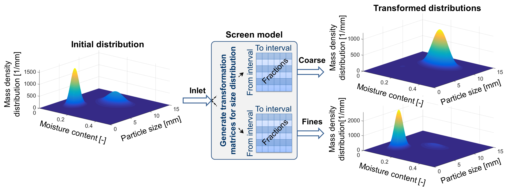

.. _label-multiDim:

=================================================
Multidimentional distributed parameters of solids
=================================================

You can see an example for a sieve model in the figure below, showing the application of the transformation matrix. 

Time points management
----------------------

