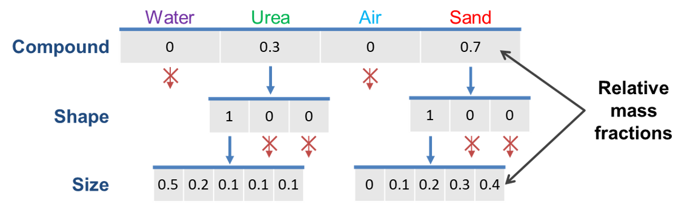

.. _label-multiDim:

=================================================
Multidimentional distributed parameters of solids
=================================================

Tree data structures
--------------------

Normally, solid phase is described with a set of **distributed parameters**, which can be **interdependent** (more parameters depend on each other). All interdependent distributed parameters form a multidimensional matrix and each entry of the matrix describes mass fractions of the solid material with the specified combination of parameters.

Currently, following distrubution parameters are available in Dyssol:

	- Compound
	
	- Size
	
	- Porosity
	
	- Form factor
	
	- Color
	
	- Other user-defined parameters

In the example below, you can find how the particle parameter distribution is described with 3-dimensional (size, compound and shape) matrices.

.. image:: ./pics/mult/3d-example.png
   :width: 400px
   :alt: 
   :align: center

|

We can find many entries of these matrices are equal to zero. Therefore, in Dyssol, the multidimensional distribution is represented with a **tree data structure** instead. The parameters are analyzed level by level, if an element is zero, it will not be considered further (sparse data formats), as you can see in the example below. 

By using the tree data structure, the amount of data and the memory consumption can be reduced, leading to the improvement the computational efficiency.

.. seealso:: Skorych et al., Novel system for dynamic flowsheet simulation of solids processes, Powder Technology 314 (2017).

|

Treatment of dependent parameters
---------------------------------

Transformation matrices
"""""""""""""""""""""""

Let's first see an example of a screening process with **explicit calculation**, which is illustrated in the figure below. 

.. image:: ./pics/mult/explicit.png
   :width: 600px
   :alt: 
   :align: center
   
In this example, large red and small blue particles are fed into the screen unit, which only considers partical size distribution. The two multidimensional parameters (color and size) are interconnected (only the combinations large/red and small/blue are allowed). If the secondary dependent parameter - color - was not explicitly considered, it would be lost or mixed (small/red and large/blue appear mistakenly).

|

To avoid such mistake, the **transformation matrices (TM)** is applied for calculation of unit outlets. TM describe laws of material transition between classes. Each entry of TM describes a fraction of material that passes from one class to another. The calculation of TM is based on different model functions. 

You can find another example for the screen unit showing the application of TM in Dyssol. 

.. image:: ./pics/mult/transMat.png
   :width: 800px
   :alt: approach with transformation matrices
   :align: center
 
You may applie TM to get distributions in holdups and unit outlets. All dependent parameters of solids are calculated automatically. Meanwhile, information about secondary distributions (in this example the moisture content) is kept.
 

.. seealso::

	1. Skorych et al., Novel system for dynamic flowsheet simulation of solids processes, Powder Technology 314 (2017).
	
	2. M.Dosta., Techn. Univ. Hamburg-Harburg, Diss., 2012.

  
   
|   

Application of transformation matrices
""""""""""""""""""""""""""""""""""""""

|

Application example
"""""""""""""""""""

The particle size distribution of an outlet stream is calculated by

.. math::

	Output = TM \otimes Input

As an example, the calculation of the outlet stream from a :ref:`label-crusher` is shown below.

