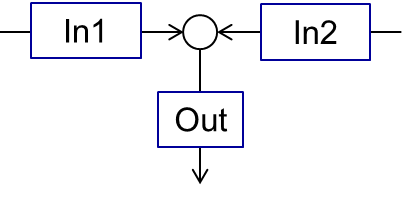
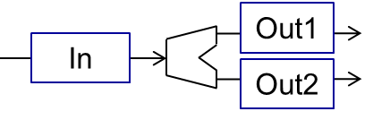

=============
Units library
=============

Introduction to available operation units...

|

Mixer
-----

A mixer mixes two input material streams (:math:`In1`, :math:`In2`) into the one output stream (:math:`Out`), as shown in the scheme below.

The output stream will be defined for all time points for which the streams :math:`In1` and :math:`In2` are defined. Mixing of more streams can be implemented by connecting of several mixers sequentially.

The parameters of output stream are calculated as:

.. math::

		\dot{m}_{out} &= \dot{m}_{in1}+\dot{m}_{in2}
		
		T_{out} &= \frac{ T_{in1}\,\dot{m}_{in1} + T_{in2}\,\dot{m}_{in2}}{\dot{m}_{out} } 
		
		P_{out} &= min( P_{in1},P_{in2} )

where :math:`\dot{m}` is a mass flow, :math:`T` is a temperature and :math:`P` is a pressure.

All secondary attributes of output stream, such as phase fractions, compounds fractions and multidimensional distributions are calculating depending on mass fractions of input streams.

Application example
^^^^^^^^^^^^^^^^^^^
Write some text about the input and output data...

.. image:: ./pics/units/mixer-eg.png
   :width: 500px
   :alt: mixer example
   :align: center

|

Splitter
--------

A splitter divides input stream (:math:`In`) into two output streams (:math:`Out1` and :math:`Out2`), as shown in the figure below.

Both output streams are defined for the same set of time points for which the input stream has been defined. The splitting of input stream into more than two fractions can be done by sequential connection of several splitter units.

You can specify the splitting factor :math:`K_{splitt}`, which is defined in following equations. Here :math:`\dot{m}` is a mass flow.

.. math::

	\dot{m}_{out1} &= K_{splitt} \cdot \dot{m}_{in}
	
	\dot{m}_{out2} &= (1-K_{splitt} ) \cdot \dot{m}_{in}

Parameter
^^^^^^^^^

====================  ======================  ========== ===========================
Name   		      Description             Unit	 Boundry
====================  ======================  ========== ===========================
:math:`K_{splitt}`    Splitting facctor       `-`        :math:`0 \leq K_{splitt} \leq 1`
====================  ======================  ========== ===========================

|

Application example
^^^^^^^^^^^^^^^^^^^
Write some text about an example...

|

Screen
------

Screen unit is designed for classification of input material into two fractions according to particle size distribution (PSD), as shown below.

.. image:: ./pics/units/screen.png
   :width: 300px
   :alt: screen
   :align: center
   

Grade efficiency models
^^^^^^^^^^^^^^^^^^^^^^^

Two models are available to describe the screen grade efficiency. 

.. note:: Notations applied in the models:

	:math:`G(x_i)` – grade efficiency: mass fraction of material within the size class :math:`i` in the feed (:math:`\dot{m}_{i,input}`) that leaves the screen in the coarse stream (:math:`\dot{m}_{i,coarse}`)

	:math:`x_{cut}` – cut size of the classification model in meter, must have a non-negative value

	:math:`\alpha` – separation sharpness, value must between 0 and 100

	:math:`x_i` – size of a particle

In the following figure several grade efficiency curves for different parameters of separations sharpness are shown.

.. image:: ./pics/units/splitter-alpha.png
   :width: 500px
   :alt: splitter
   :align: center

Plitt's model
"""""""""""""

.. math::

	G(x_i) = 1 - exp\left(-0.693\,\left(\frac{x_i}{x_{cut}}\right)^\alpha\right)
	
*Please refer to [Plitt, L.R.: The analysis of solid–solid separations in classifiers. CIM Bulletin 64 (708), p. 42–47, 1971] for more information.*	

Molerus & Hoffmann model
""""""""""""""""""""""""

.. math::

	G(x_i) = \dfrac{1}{1 + \left( \frac{x_{cut}}{x_i} \right)^2 \cdot exp\left( \alpha \,\left( 1 - \left(\frac{x_i}{x_{cut}}\right)^2 \right)\right)}

*Please refer to [Molerus, O.; Hoffmann, H.: Darstellung von Windsichtertrennkurven durch ein stochastisches Modell, Chemie Ingenieur Technik, 41 (5+6), 1969, pp. 340-344] for more information.*

Probability model
^^^^^^^^^^^^^^^^^

.. note:: Notations applied in this model:

	:math:`G(x_i)` – grade efficiency: mass fraction of material within the size class :math:`i` in the feed (:math:`\dot{m}_{i,input}`) that leaves the screen in the coarse stream (:math:`\dot{m}_{i,coarse}`)

	:math:`x_i` – size of a particle
	
	:math:`\sigma` – standard deviation of the normal output distribution in meter, must be non-negative

	:math:`\mu` – mean of the normal output distribution in meter, must be non-negative

	:math:`N` – number of classes of particle size distribution

.. math::

	G(x_i) = \dfrac{ \sum^{x_i}_{0} e^\frac{(x_i - \mu)^2}{2\sigma^2} }{ \sum^{N}_{0} e^\frac{(x_i - \mu)^2}{2\sigma^2} }

*Please refer to [Radichkov, R.; Müller, T.; Kienle, A.; Heinrich, S.; Peglow, M.; Mörl, L.: A numerical bifurcation analysis of continuous fluidized bed spray granulation with external product classification, Chemical Engineering and Processing 45, 2006, pp. 826–837] for more information.*

Teipel / Hennig model
^^^^^^^^^^^^^^^^^^^^^

.. note:: Notations applied in the models:

	:math:`G(x_i)` – grade efficiency: mass fraction of material within the size class :math:`i` in the feed (:math:`\dot{m}_{i,input}`) that leaves the screen in the coarse stream (:math:`\dot{m}_{i,coarse}`)

	:math:`x_{cut}` – cut size of the classification model in meter, must have a non-negative value

	:math:`\alpha` – separation sharpness, value must between 0 and 100
	
	:math:`\beta` - separation sharpness, value must between 0 and 100
	
	:math:`a` - separation offset, value must between 0 and 1

	:math:`x_i` – size of a particle

.. math::

	G(x_i) = \left(  1-   \left( 1 + 3 \cdot \left( \dfrac{x_i}{x_{cut}} \right)^{\left(\dfrac{x_i}{x_{cut}} + \alpha \right)\cdot \beta} \right)^{-1/2}	\right) \cdot (1 - a) + a

*Please refer to [Hennig, M. and Teipel, U. (2016), Stationäre Siebklassierung. Chemie Ingenieur Technik, 88: 911–918] for more information.*

Application example
^^^^^^^^^^^^^^^^^^^

.. warning::

	*Size distribution has not been defined* will shown if PSD is not defined.   

One example for probability model...

One example for Teipel / Hennig model...

Crusher
-------

Bunker
------

Granulator
----------

Batch cystallizer
-----------------

One-dimensonal
^^^^^^^^^^^^^^

Two-dimensonal
^^^^^^^^^^^^^^

Electrostatic precipitator
--------------------------

Heat exchanger
--------------

Calciner
--------

