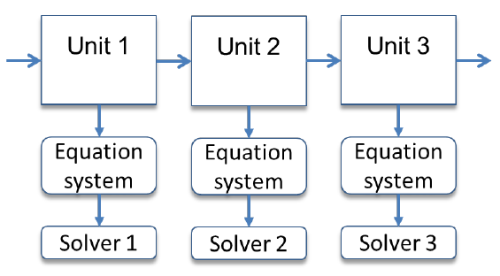
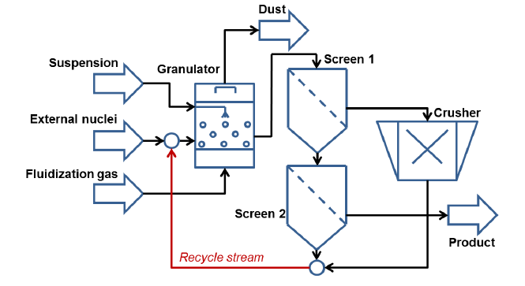
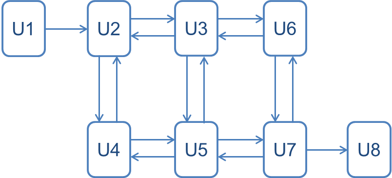
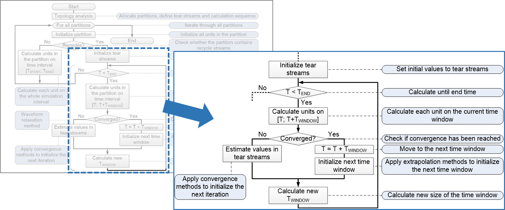
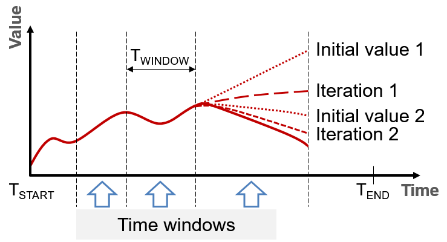
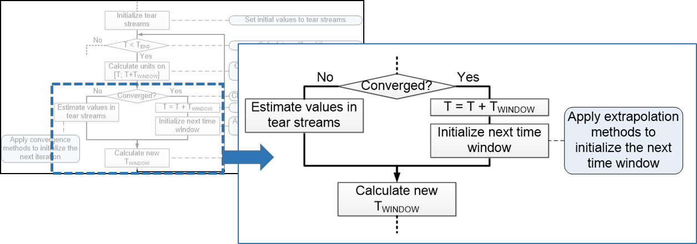

======================
Theoretical background
======================

Here you will find theory about process systems and numerical calculation, which helps you to understand the simulation principle applied in Dyssol.

Process systems
---------------

.. _label-seqModule:

Sequential-modular approach
"""""""""""""""""""""""""""

The simulator of Dyssol applies sequential-modular approach, which processes the units in sequence. For each unit there are a equation system and the corresponding solver, as shown in the figure below.

The advantages of this approach are listed as follows:

	- Conceptual simplicity,

	- Correspondence to the physical structure of processes,

	- Higher flexibility,

	- Possibility to use different numerical methods to calculate models.

However, difficulties may occur when processing flowsheets with recycle streams.

.. seealso::

	W. Marquardt, Dynamic process simulation - recent progress and future challenges (1991)

|

Equation-oriented approach
""""""""""""""""""""""""""

Unlike sequential-modular approach, the equation-oriented approach processes all units with a whole equation system and the same solver.

.. image:: ./pics/theory/eq-module.png
   :width: 500px
   :alt: screen
   :align: center

It has the following advantages:

	- Equations are homogenized and calculated by a single solver,

	- Better convergence rate, especially on complex flowsheets with recycles.

However, difficulties may occur with simultaneous stimulation of fast and slow changed components, and the usage with heterogeneous models is complicated.

.. seealso::

	W. Marquardt, Dynamic process simulation - recent progress and future challenges (1991)

|

.. _label-partition:

Partitioning and tearing
""""""""""""""""""""""""

Dyssol converts the process structure into a suitable sequential form, initializes recycle streams (tear streams) with some values, combines units in recycle loops into partitions, and then solves an entire partition (a recycle system) iteratively over the whole simulation time and separately from other partitions.

An example is shown in the following process flow sheet.

For this flow sheet, the operation units and streams with 3 partitions are shown below schematically.

.. image:: ./pics/theory/example-tear.png
   :width: 700px
   :alt: screen
   :align: center

|

Alternatively, single and multiple schemes can be applied.

For a single scheme, the units and streams are rearranged as below.

.. image:: ./pics/theory/singlepart.png
   :width: 900px
   :alt: screen
   :align: center

The partitions and corresponding streams are:

	- Partition 1: U1 as normal stream
	
	- Partition 2: U2 as normal stream
	
	- Partition 3: U3, U4, U5, U6 as normal streams; S1 and S2 as tear streams
	
	- Partition 4: U7, U8 as normal streams; S3 as tear streams

|

Furthermore, the bi-directional connection can be represented in Dyssol as two independent material streams. One of the streams will eventually be selected as a tear stream.

An example is shown in the figure below.

   
The corresponding calculation sequence is 

.. image:: ./pics/theory/bi-directSeq.png
   :width: 650px
   :alt: screen
   :align: center
   
The partition and streams are:

	- Partition 1: U1 as normal stream
	
	- Partition 2: U2, U3, U4, U5, U6, U7 as normal stream; S1, S2, S3, S4, S5, S6, S7 as tear streams
	
	- Partition 3: U8 as normal stream

|

Numerical methods
-----------------

.. _label-waveRelax:

Waveform relaxation method
""""""""""""""""""""""""""

The waveform relaxation method (WRM) is applied to calculate the tear streams. You can find the algorithm in the flow sheet below.

Dyssol splits the whole simulation interval into smaller time windows, it calculates the entire partition on the time window iteratively until convergence occurs, and then initializes parameters of tear streams before calculation of each time window.

Size of the time window varies depending on the convergence rate, and the convergence criterion is the difference between values on successive iterations.

.. seealso::

	E. Lelarasmee, the waveform relaxation method for time domain analysis of large scale integrated circuits (1982)

|

.. _label-extrapolation:

Data extrapolation
""""""""""""""""""

Dyssol initializes all parameters of tear streams within the time window before its calculation, and then uses extrapolated values from the previous time intervals as initial data. Prediction accuracy affects the number of iterations required to achieve convergence.

The implemented methods for extrapolation include nearest-neighbor, linear and spline.

.. image:: ./pics/theory/extrapolation-diagram.png
   :width: 500px
   :alt: screen
   :align: center

|

.. _label-convergence:

Convergence methods
"""""""""""""""""""

Dyssol uses different convergence methods to initialize parameters of tear streams before each iteration, performs calculations iteratively and stops iterative calculations when the convergence is reached. Between each value, different methods can be applied, as shown in the figure below.

.. image:: ./pics/theory/convergence.png
   :width: 600px
   :alt: screen
   :align: center

Three convergence methods are available in Dyssol:

- Direct substitution: 

	:math:`x_{k+1} = (1-\lambda)\,F(x_{k-1}) + \lambda F(x_k)`
	
- Wegstein's method: 

	:math:`x_{k+1} = q x_k + (1-q) F(x_k)`

- Steffensen's method: 

	:math:`x_{k+3} = x_k - \dfrac{(x_{k+1} - x_k)^2}{x_{k+2} - 2x_{k+1} + x_k}`

.. seealso:: 

	a demostration file at ``<Help\Convergence.pdf>``.

