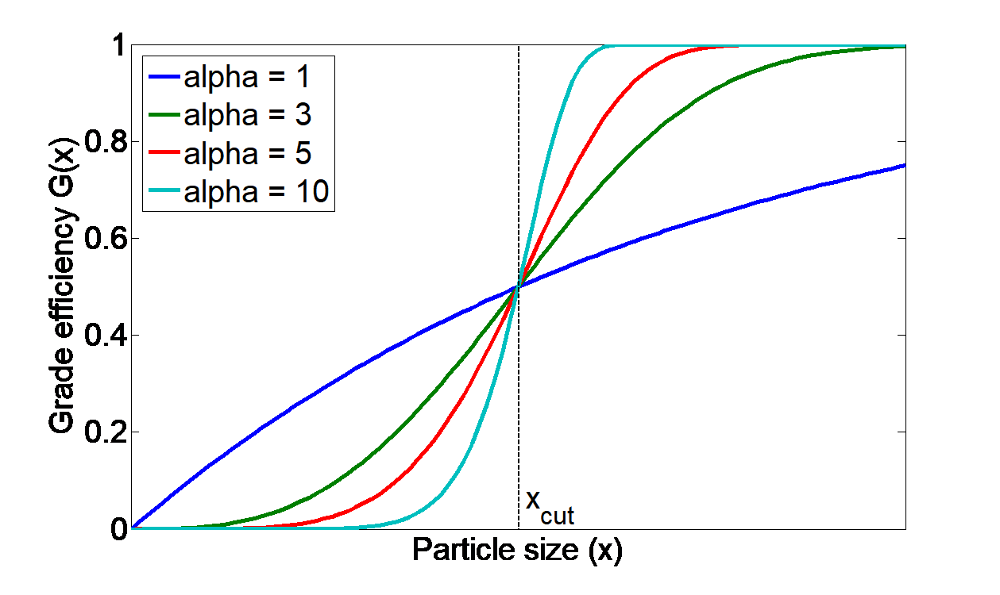

=============
Units library
=============

An operation unit is a ...

Mixer
=====

A mixer mixes two input material streams (:math:`In1`, :math:`In2`) into the one output stream (:math:`Out`), as shown in the scheme below.

.. image:: ./pics/units/mixer.png
   :width: 300px
   :alt: mixer
   :align: center

The output stream will be defined for all time points for which the streams :math:`In1` **and** :math:`In2` are defined. Mixing of more streams can be implemented by connecting of several mixers sequentially.

The parameters of output stream are calculated as:

.. math::

		\dot{m}_{out} &= \dot{m}_{in1} + \dot{m}_{in2}
		
		\dot{H}_{out} &= \dot{H}_{in1} + \dot{H}_{in2}
		
		T_{out} &= f(h_{out}) = f \left( \frac{\dot{H}_{out}}{\dot{m}_{out}} \right)
		
		P_{out} &= min( P_{in1},P_{in2} )

.. note:: Notations:

	:math:`\dot{m}` – mass flow 
	
	:math:`\dot{H}` - enthalpy flow
	
	:math:`h` - specific enthalpy
	
	:math:`T` - temperature
	
	:math:`P` - pressure

All secondary attributes of output stream, such as phase fractions, compounds fractions and multidimensional distributions are calculated depending on mass fractions of input streams.

Application example
^^^^^^^^^^^^^^^^^^^

.. note:: Input parameters needed for the simulation:

	Mass flow in kg/s, value must be positive.
	
	Temperatur in K, value must be positive. ?
	
	Pressure in Pa, value must be positive. ?
	
	Phase fraction ?
	
	Sauter diameter ?
	

You can find a demostration file in install path ``<Example Flowsheets/Units/Mixer.dlfw>``.

Input model parameters:

+---------------+-----------------------------------+-----------------------------------+
|               | Input 1                           | Input 2                           |
+---------------+-----------------+-----------------+-----------------+-----------------+
| Timepoint [s] | Massflow [kg/s] | Temperature [K] | Massflow [kg/s] | Temperature [K] |
+===============+=================+=================+=================+=================+
| 0             | 10              | 300             | 5               | 400             |
+---------------+-----------------+-----------------+-----------------+-----------------+
| 60            | 7.5             | 300             | 10              | 400             |
+---------------+-----------------+-----------------+-----------------+-----------------+

|
	
Simulation result for mass flows:

.. image:: ./pics/units/mixer-egMass.png
   :width: 700px
   :alt: mixer example
   :align: center
   
|   
  
  
Simulation result for temperatures: 
 
.. image:: ./pics/units/mixer-egTemp.png
   :width: 700px
   :alt: mixer example
   :align: center   
   
|

Splitter
========

A splitter divides input stream (:math:`In`) into two output streams (:math:`Out1` and :math:`Out2`), as shown in the figure below.

.. image:: ./pics/units/splitter.png
   :width: 300px
   :alt: mixer
   :align: center

Both output streams are defined for the same set of time points for which the input stream has been defined. The splitting of input stream into more than two fractions can be done by sequential connection of several splitter units.

You can specify the splitting factor :math:`K_{splitt}`, which is defined in following equations. Here :math:`\dot{m}` is a mass flow.

.. math::

	\dot{m}_{out1} &= K_{splitt} \cdot \dot{m}_{in}
	
	\dot{m}_{out2} &= (1-K_{splitt} ) \cdot \dot{m}_{in}

.. note:: Notations:

	:math:`\dot{m}` - mass flow
	
	:math:`K_{splitt}` - Splitting factor

|

Application example
^^^^^^^^^^^^^^^^^^^

.. note:: Input parameters needed for the simulation:
	
	Mass flow in kg/s, value must be positive.
	
	Splitting factor, value must between 0 and 1.

Write some text about an example...

|

Screen
======

Screen unit is designed for classification of input material into two fractions according to particle size distribution (PSD), as shown below.

.. image:: ./pics/units/screen.png
   :width: 300px
   :alt: screen
   :align: center

In Dyssol, 4 models are available to describe the screen grade efficiency. 

In the following figure several grade efficiency curves for different parameters of separations sharpness are shown.

Plitt's model
^^^^^^^^^^^^^

.. math::

	G(x_i) = 1 - exp\left(-0.693\,\left(\frac{x_i}{x_{cut}}\right)^\alpha\right)

.. note:: Notations applied in the models:

	:math:`G(x_i)` – grade efficiency: mass fraction of material within the size class :math:`i` in the feed (:math:`\dot{m}_{i,input}`) that leaves the screen in the coarse stream (:math:`\dot{m}_{i,coarse}`)

	:math:`x_{cut}` – cut size of the classification model in meter, must have a non-negative value

	:math:`\alpha` – separation sharpness, value must between 0 and 100

	:math:`x_i` – size of a particle

	
.. seealso::

	Plitt, L.R.: The analysis of solid–solid separations in classifiers. CIM Bulletin 64 (708), p. 42–47, 1971	

Molerus & Hoffmann model
^^^^^^^^^^^^^^^^^^^^^^^^

.. math::

	G(x_i) = \dfrac{1}{1 + \left( \dfrac{x_{cut}}{x_i} \right)^2 \cdot exp\left( \alpha \,\left( 1 - \left(\dfrac{x_i}{x_{cut}}\right)^2 \right)\right)}

.. note:: Notations applied in the models:

	:math:`G(x_i)` – grade efficiency: mass fraction of material within the size class :math:`i` in the feed (:math:`\dot{m}_{i,input}`) that leaves the screen in the coarse stream (:math:`\dot{m}_{i,coarse}`)

	:math:`x_{cut}` – cut size of the classification model in meter, must have a non-negative value

	:math:`\alpha` – separation sharpness, value must between 0 and 100

	:math:`x_i` – size of a particle

.. seealso::

	Molerus, O.; Hoffmann, H.: Darstellung von Windsichtertrennkurven durch ein stochastisches Modell, Chemie Ingenieur Technik, 41 (5+6), 1969, pp. 340-344

Probability model
^^^^^^^^^^^^^^^^^

.. math::

	G(x_i) = \dfrac{ \sum\limits^{x_i}_{0} e^{-\dfrac{(x_i - \mu)^2}{2\sigma^2}} }{ \sum\limits^{N}_{0} e^{-\dfrac{(x_i - \mu)^2}{2\sigma^2}} }

.. note:: Notations applied in this model:

	:math:`G(x_i)` – grade efficiency: mass fraction of material within the size class :math:`i` in the feed (:math:`\dot{m}_{i,input}`) that leaves the screen in the coarse stream (:math:`\dot{m}_{i,coarse}`)

	:math:`x_i` – size of a particle
	
	:math:`\sigma` – standard deviation of the normal output distribution in meter, must be non-negative

	:math:`\mu` – mean of the normal output distribution in meter, must be non-negative

	:math:`N` – number of classes of particle size distribution

.. seealso::
	Radichkov, R.; Müller, T.; Kienle, A.; Heinrich, S.; Peglow, M.; Mörl, L.: A numerical bifurcation analysis of continuous fluidized bed spray granulation with external product classification, Chemical Engineering and Processing 45, 2006, pp. 826–837

Teipel / Hennig model
^^^^^^^^^^^^^^^^^^^^^

.. math::

	G(x_i) = \left(  1-   \left( 1 + 3 \cdot \left( \dfrac{x_i}{x_{cut}} \right)^{\left(\dfrac{x_i}{x_{cut}} + \alpha \right)\cdot \beta} \right)^{-1/2}	\right) \cdot (1 - a) + a
	
	
.. note:: Notations applied in the models:

	:math:`G(x_i)` – grade efficiency: mass fraction of material within the size class :math:`i` in the feed (:math:`\dot{m}_{i,input}`) that leaves the screen in the coarse stream (:math:`\dot{m}_{i,coarse}`)

	:math:`x_{cut}` – cut size of the classification model in meter, must have a non-negative value

	:math:`\alpha` – separation sharpness, value must between 0 and 100
	
	:math:`\beta` - separation sharpness, value must between 0 and 100
	
	:math:`a` - separation offset, value must between 0 and 1

	:math:`x_i` – size of a particle
	

.. seealso::
	Hennig, M. and Teipel, U. (2016), Stationäre Siebklassierung. Chemie Ingenieur Technik, 88: 911–918

Crusher
=======

A crusher comminutes the input material stream and reduces the average particle size. The schema is illustrated below.

.. image:: ./pics/units/crusher.png
   :width: 200px
   :alt: splitter
   :align: center

This unit can be described using 3 models in Dyssol: Bond's model, cone model and const model.

Bond's model
^^^^^^^^^^^^

This model is used to perform milling of the input stream. The crushing is performed according to the model proposed by Bond.

.. math::
	
	x_{out} = \dfrac{1}{ \left( \dfrac{P}{10\,w_i\,\dot{m}} + \dfrac{1}{\sqrt{x_{in}}} \right)^2}

After simplification, the particle size distribution of the output stream is described with normal function: 

.. math::
	
	q_3(x) = \frac{1}{\sigma\sqrt{2\pi}}\,e^{-\dfrac{(x-\mu)^2}{2\sigma^2}}

.. note:: Notations applied in this model:
	
	:math:`x_{out}` – characteristic particle size of the output stream (:math:`x_{80}`)
	
	:math:`x_{in}` – characteristic particle size of the input stream (:math:`x_{80}`)
	
	:math:`w_i` – Bond Work Index, dependent on the material 
	
	:math:`P` – power input 
	
	:math:`\dot{m}` – mass flow of the input stream
	
	:math:`q_3(x)` – mass related density distribution
	
	:math:`\sigma` – standard deviation of the output distribution
	
	:math:`\mu` – mean of the output distribution

Average Bond Work Indices for various materials
"""""""""""""""""""""""""""""""""""""""""""""""

+-----------------------------+-------------------------+--------------------+-------------------------+
| Material                    | Work Bond Index [kWh/t] | Material           | Work Bond Index [kWh/t] |
+=============================+=========================+====================+=========================+
| Andesite                    | 20.08                   | Iron ore, oolitic  | 12.46                   |
+-----------------------------+-------------------------+--------------------+-------------------------+
| Barite                      | 5.2                     | Iron ore, taconite | 16.07                   |
+-----------------------------+-------------------------+--------------------+-------------------------+
| Basalt                      | 18.18                   | Lead ore           | 13.09                   |
+-----------------------------+-------------------------+--------------------+-------------------------+
| Bauxite                     | 9.66                    | Lead-zinc ore      | 12.02                   |
+-----------------------------+-------------------------+--------------------+-------------------------+
| Cement clinker              | 14.8                    | Limestone          | 14                      |
+-----------------------------+-------------------------+--------------------+-------------------------+
| Clay                        | 6.93                    | Manganese ore      | 13.42                   |
+-----------------------------+-------------------------+--------------------+-------------------------+
| Coal                        | 14.3                    | Magnesite          | 12.24                   |
+-----------------------------+-------------------------+--------------------+-------------------------+
| Coke                        | 16.84                   | Molybdenum         | 14.08                   |
+-----------------------------+-------------------------+--------------------+-------------------------+
| Copper ore                  | 13.99                   | Nickel ore         | 15.02                   |
+-----------------------------+-------------------------+--------------------+-------------------------+
| Diorite                     | 22.99                   | Oil shale          | 17.43                   |
+-----------------------------+-------------------------+--------------------+-------------------------+
| Dolomite                    | 12.4                    | Phosphate rock     | 10.91                   |
+-----------------------------+-------------------------+--------------------+-------------------------+
| Emery                       | 62.45                   | Potash ore         | 8.86                    |
+-----------------------------+-------------------------+--------------------+-------------------------+
| Feldspar                    | 11.88                   | Pyrite ore         | 9.83                    |
+-----------------------------+-------------------------+--------------------+-------------------------+
| Ferro-chrome                | 8.4                     | Pyrrhotite ore     | 10.53                   |
+-----------------------------+-------------------------+--------------------+-------------------------+
| Ferro-manganese             | 9.13                    | Quartzite          | 10.54                   |
+-----------------------------+-------------------------+--------------------+-------------------------+
| Ferro-silicon               | 11                      | Quartz             | 14.93                   |
+-----------------------------+-------------------------+--------------------+-------------------------+
| Flint                       | 28.78                   | Rutile ore         | 13.95                   |
+-----------------------------+-------------------------+--------------------+-------------------------+
| Fluorspar                   | 9.8                     | Shale              | 17.46                   |
+-----------------------------+-------------------------+--------------------+-------------------------+
| Gabbro                      | 20.3                    | Silica sand        | 15.51                   |
+-----------------------------+-------------------------+--------------------+-------------------------+
| Glass                       | 13.54                   | Silicon carbide    | 27.46                   |
+-----------------------------+-------------------------+--------------------+-------------------------+
| Gneiss                      | 22.14                   | Slag               | 11.26                   |
+-----------------------------+-------------------------+--------------------+-------------------------+
| Gold ore                    | 16.42                   | Slate              | 15.73                   |
+-----------------------------+-------------------------+--------------------+-------------------------+
| Granite                     | 16.64                   | Sodium silicate    | 14.74                   |
+-----------------------------+-------------------------+--------------------+-------------------------+
| Graphite                    | 47.92                   | Spodumene ore      | 11.41                   |
+-----------------------------+-------------------------+--------------------+-------------------------+
| Gravel                      | 17.67                   | Syenite            | 14.44                   |
+-----------------------------+-------------------------+--------------------+-------------------------+
| Gypsum rock                 | 7.4                     | Tin ore            | 11.99                   |
+-----------------------------+-------------------------+--------------------+-------------------------+
| Iron ore ,hematite          | 14.12                   | Titanium ore       | 13.56                   |
+-----------------------------+-------------------------+--------------------+-------------------------+
| Iron ore, hematite-specular | 15.22                   | Trap rock          | 21.25                   |
+-----------------------------+-------------------------+--------------------+-------------------------+
| Iron ore, magnetite         | 10.97                   | Zinc ore           | 12.72                   |
+-----------------------------+-------------------------+--------------------+-------------------------+

.. seealso::

	Denver Sala Basic: Selection Guide for Process Equipment, 1993

Application example
"""""""""""""""""""

.. note:: Input parameters needed for the simulation:
	
	Power input in kW, value must be positve.
	
	Bond Work Index in kWh/t, value must between 1 and 100.
	
	Standard deviation of output distribution in m, value must be positve.

You can find a demostration file in install path ``<Example Flowsheets/Units/Crusher Bond.dlfw>``.	
	
Input model parameters:
	
	+----------+-----------------+-------------------------------------------+
	| Pressure | Bond Work Index | Standard deviation of output distribution |
	+==========+=================+===========================================+
	| 100 kW   | 10 kWh/t        | 0.0008 m                                  |
	+----------+-----------------+-------------------------------------------+

Simulation result for particle size distribution:

.. image:: ./pics/units/crusherBondResult.png
	:width: 700px
	:alt: bond
	:align: center

Cone model
^^^^^^^^^^

The model is described below as

.. math::
	
	w_{out,i} = \sum\limits^{i}_{k=0} w_{in,k} \cdot S_k \cdot B_{ki} + (1-S_i)\,w_{in,i}
	
.. note:: Notations:

	:math:`w_{out,i}` – mass fraction of particles with size :math:`i` in output distribution
	
	:math:`w_{in,i}` – mass fraction of particles with size :math:`i` in inlet distribution
	
	:math:`S_k` – mass fraction of particles with size :math:`k`, which will be crushed
	
	:math:`B_{ki}` – mass fraction of particles with size :math:`i`, which get size after breakage less or equal to :math:`k`

:math:`S_k` is described by the King selection function.

.. math::
	
	S_k = 
	\begin{cases}
    0 											  & x_k \leqslant x_{min} \\
    1 - \dfrac{x_{max} - x_i}{x_{max} - x_{min}}  & x_{min} < x_k < x_{max} \\
    1											  & x_k \geqslant x_{max}
	\end{cases} 

.. math::
		
	x_{min} = CSS \cdot \alpha_1
	
	x_{max} = CSS \cdot \alpha_2
		
.. note:: Notations:
	
	:math:`x_k` – mean particle diameter in size-class :math:`k`
	
	:math:`CSS` – close size setting of a cone crusher
	
	:math:`\alpha_1, \alpha_2, n` – parameters of the King selection function

.. seealso::
	
	King, R. P., Modeling and simulation of mineral processing systems, Butterworth & Heinemann, Oxford, 2001.

:math:`B_{ki}` is calculated by the Vogel breakage function.

.. math::
	
	B_{ki} = 
	\begin{cases}
	0.5\, \left( \dfrac{x_i}{x_k} \right)^q \cdot \left( 1 + \tanh \left( \dfrac{x_k - x'}{x'} \right) \right) & i \geqslant k \\
	0 & i < k
	\end{cases}
	
	
.. note:: Notations:

	:math:`x'` – minimum fragment size which can be achieved by crushing
	
	:math:`q` – parameter of the Vogel breakage function

.. seealso::
	
	Vogel, L., Peukert, W., Modelling of Grinding in an Air Classifier Mill Based on A Fundamental Material Function, KONA, 21, 2003, 109-120.

